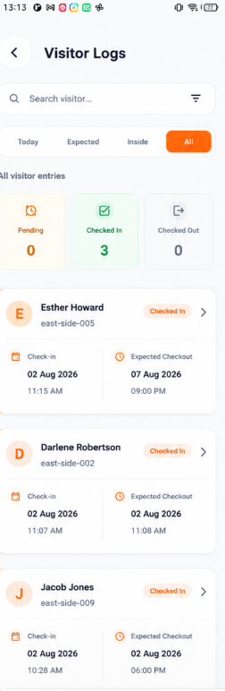
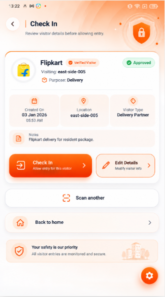
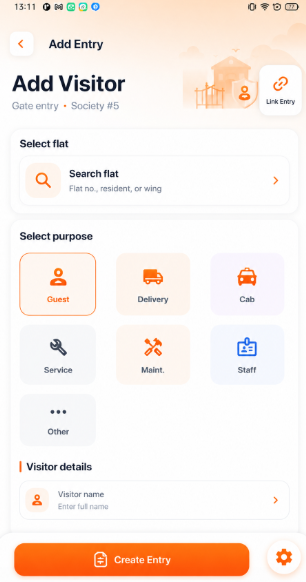

# while listing entry 1st thing i want to chnage in api is check in details checkout details

# check in api that why when entry is creted expected check out is not showing and this expected chekout comes from society_settings from default_visit_duration_minutes this field

# in app in vistor entries show like chekin/expected checkin and checkout /expected checkout based on what info is present along with current status

# also ask user if invited via resident link in visit/token expected checkin and chekout checkin is mandatory and checkout is optional field

# approve and check in must also be based on socieety_setting varibale name allow_guard_on_behalf_approval and allow_guard_entry as well for adding entry and approving entry chek this field if they are false then guard is unable to perform this action and show warning to guard that your admin has not allowed this feature something like that

# inside card for that visitor show full name mobile number email if present purpose of visiting campanion companion details if companion are there vehicle number if present and finally notes if given by visitor also show in which flat they are visiting

# when scanning any qr code if scan is done let guard able to modify means he can add or modify vehicle_number visitor name email phone number photo_url companion details and work notes as well so give edit button also over there

# at entry page in my app seach bar for seaching active flat and user input are not working correctly and while searching also show flat primary owner name along with flat

# if entry is staff they do not required approval from flat owner or flat details in which flat they are visiting they need only name and number thats it optional field are vehicle number companion count notes other details like invite id flat id and all{

"data": {
"entry": {
"approved_at": "string",
"approved_by": 0,
"auto_closed_at": "string",
"checked_in_at": "string",
"checked_out_at": "string",
"companion_details": [
{
"additionalProp1": "string",
"additionalProp2": "string",
"additionalProp3": "string"
}
],
"companions_count": 0,
"created_at": "string",
"created_by": 0,
"delivery_partner": "string",
"expected_at": "string",
"expected_checkout_at": "string",
"flat": {
"block": "string",
"flat_number": "string",
"floor": "string",
"id": 0
},
"flat_id": 0,
"handled_by_guard_id": 0,
"id": 0,
"invite_id": 0,
"metadata": {
"additionalProp1": "string",
"additionalProp2": "string",
"additionalProp3": "string"
},
"notes": "string",
"purpose": "guest",
"qr_expires_at": "string",
"qr_used_at": "string",
"rejected_by": 0,
"rejection_reason": "string",
"service_provider": "string",
"society_id": 0,
"source": "resident_link",
"status": "waiting_approval",
"updated_at": "string",
"vehicle_number": "string",
"vehicle_type": "bike",
"visitor": {
"email": "string",
"full_name": "string",
"phone_number": "string",
"photo_url": "string"
},
"visitor_id": 0
},
"qr": {
"expires_at": "string",
"token": "string"
}
},
"message": "Visitor entry created successfully",
"success": true
} this field should be handled correctly according to the entry type

# check in page reference

# this is create entry by guard page must look like take a reference

